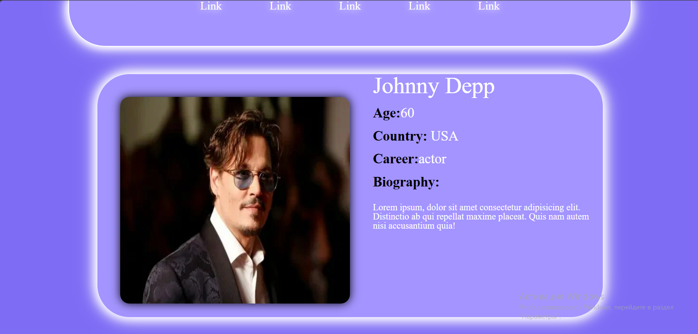

# HTML/CSS Profile Card Page
## Screenshot

## Description

This is a small static web page built with HTML and CSS.  
The project demonstrates layout design, styling, working with images, typography, spacing, and visual effects.

## Features

- Static profile card layout
- Navigation bar
- Image block
- Text content section
- CSS styling
- Rounded corners and shadow effects
- Custom color palette

## Technologies

- HTML5
- CSS3

## How to View

Open `index.html` in a browser.

## Future Improvements

- Add responsive design
- Replace placeholder links with real navigation
- Add JavaScript interactivity
- Improve mobile layout
